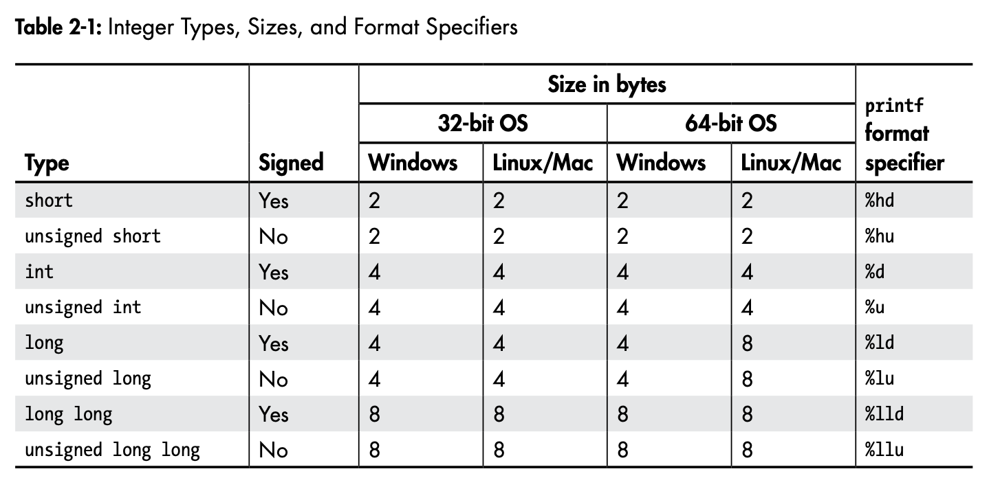

# Chapter 2 Notes: Types

A type declares how an object is represented in memory and interpreted by the compiler. **Every** object in C++ has a type. 

## Table of Contents
1. [Fundamental Types](#fundamental-types)
2. [Arrays](#arrays)
3. [For Loops](#for-loops)
4. [User Defined Types](#user-defined-types)
5. [Fully Featured C++ Classes](#fully-featured-c-classes)

## Fundamental Types

These are the most basic types in C++, these include `int`, `float`, `double`, `char`, `bool` and `void`. They will work on any platform but their features and memory size vary. 

**Integer Types**

Integer types store whole numbers, they can be `short int, int, long int` or `long long int`. Each can either be singed or unsigned (unsigned is just positive including 0, signed can be positive, 0 and negative). Int types are singed by default. See below of a chart of the number of bits, each type of int can take up. 

Note that type sizes can change across platforms, normally the compiler will tell us of a mismatch between format specifiers and integer types, but we should handle them ourselves when being used in `printf` statements.

If we want to **enforce** integer sizes we cna use the `cstdint` library, using 8, 16, 32, 64 bits for int8_t, int16_t, int32_t and int64_t respectively, but this is not available on all platforms so only use when there is NO other option.

**Floating Point Types**

Floats are used to store real numbers (any number with a decimal point) like 0.3333 or 59.9. The length of numbers behind the decimal point is dictated by the *precision* of the float, the more precision the float has the more memory it will take up, but the more accurate it will be. There are three levels of precision in C++: `float, double` and `long double`. Usually floats take up 4 bytes in memory and doubles/long doubles take up 8 bytes. As a rule of thumb, to avoid getting caught out, it is a good idea to use `double` for all floating point numbers.

We can format floats with the following format specifiers: `%f, %e, %g` for `float`, `%lf, %le, %lg` for `double` and `%Lf, %Le, %Lg` for `long double`.

**Character Types**

Character types (chars) store human language data, as we know from CS50, a string is just an array of chars (char*). By default a char is 1 byte in size, but this can vary across platforms. We can use the `char` type to store any character in the ASCII table, but we can also use the `wchar_t` type to store any character in the Unicode table.

There are also things called escape characters, these do not represent a single character but instead represent a special character. For example `\n` represents a new line, `\t` represents a tab and `\\` represents a backslash. See the photo below.

The format specifiers for character types are `%c` for `char` and `%lc` for `wchar_t`.

**Boolean Types**

Boolean types are used to represent true or false values. They are represented by the `bool` type and can take up 1 byte in memory. The format specifier for boolean types is `%d`.

**Logical Operators**

Logical operators evaluate boolean logic on bool types. We can classify the operators based on how many operands they take.

Unary operators take a single operand, the `!` operator is a unary operator, it takes a single operand and returns the opposite boolean value, !true is false and !false is true. This is read as 'not'.

Binary operators take two operands, the `&&` and `||` operators are binary operators. `&&` is the logical AND operator, it returns true if both operands are true, otherwise it returns false. `||` is the logical OR operator, it returns true if either of the operands are true, otherwise it returns false.

**Void**

The void type has an empty set of values, it is only used in the return type for functions that do not return a value. For example"
    
        void printHello(){
            printf("Hello World!\n");
        }
    
        int main(void){
            printHello();
            return 0;
        }

We will learn more about void in chapter 3.

## Arrays

Arrays are a collection of objects of the same type. Array types are the type of data they store, followed by the number of elements in the array. For example `int[5]` is an array of 5 integers. We can declare an array as such:

    int x[5];

We can initialize arrays in the following way:

    int x[5] = {1, 2, 3, 4, 5};

    or 

    int x = {1, 2, 3, 4, 5}; // compiler will infer the size of the array

**Accessing Array Elements**

We can access array elements using square brackets `[ ]`, arrays of 0 indexed so the final element in the array lies at index `len(array) - 1` .

    int x[5] = {1, 2, 3, 4, 5};
    printf("%d\n", x[0]); // prints 1
    printf("%d\n", x[4]); // prints 5

## For Loops

For loops allow us to iterate over a collection of objects. The syntax of a for loop is:

    for (initialization-statement; condition; increment-statement){
        // code to run
    }

The init statement code is run before the first iteration of the loop executes, so we can initailize variables here. The condition is checked before each iteration of the loop, if it is true the loop will execute, if it is false the loop will terminate. The increment statement is run after each iteration of the loop, so we can increment variables here. 

    int x[5] = {1, 2, 3, 4, 5};
    for (int i = 0; i < 5; i++) {
        printf("%d\n", x[i]);
    }

**Range-Based for Loops**

We have used a for loop to iterate over elements in an array, but we can also do this while eliminated the need to use the incrementing variable to index. This is called a range-based for loop. The syntax is:

    for (element-type var_name : array-name){
        // code to run
    }

We declare the iterator variable in element-name, the type of the element goes before that adn we hand the for-loop the array after the colon. The for loop will iterate over each element in the array.

    int x[5] = {1, 2, 3, 4, 5};
    for (int i : x) {
        printf("%d\n", i);
    }

Using range-based for loops improves our program as we have discarded to iterator simplifying the loop nicely. 

**Number of Elements in an Array**

We can see the number of bytes in the array using the `sizeof` operator, then using a division to get the number of elements in the array. 

    int x[5] = {1, 2, 3, 4, 5};
    int num_elements = sizeof(x) / sizeof(x[0]);
    printf("%d\n", num_elements); // prints 5

This type of evaluation happens at complie time, which means there is no runtime cost for getting the size of an array this way. 
There are other ways to store data (we will explore later) but if we need to use an array and don't want to hack the length using the method above we just need to use th `<iterator>` header file and std::size function.

**C Style Strings**

As we know, strings are just contiguous arrays of characters. A C-style string has a null terminator at the end of the string, this is a character with the value of 0. This is how the compiler knows where the string ends. Because arrays are contiguous, we can store strings in arrays as characters. 

    #include <cstdio>
    #include <string>
    #include <iostream>

    int main(void) {
        char bar_string[] = "Hello World\n";
        printf("%s", bar_string);

        char *foo_string = "Hello World\n";
        printf("%s", foo_string);

        std::string baz_string = "Hello World\n";
        std::cout << bar_string << std::endl; // printf only accepts C-style strings https://stackoverflow.com/questions/10865957/printf-with-stdstring. 
    }

## User Defined Types

User defined types are types that we can define ourselves, there are 3 main categories for user defined types.
1. Enumerations - These are the simplest user defined types. The values that enumeration can take are restricted to a set of possible values.

2. Classes - These are the same sort of thing as python, we are allowed to pair data and functions with a class. Classes that only contain data are called plain-old-data (POD) classes.

3. Unions - A weird type that allows us to store different types of data in the same memory location. There are dangerous to play around with.

**Enumerations**

We declare enumerations using the `enum class` keyword followed by the type name and the possible values in curly braces. 

    enum class Color {RED, BLUE, GREEN};

We can initialize an enumeration variable to a value using the :: syntax.

    enum class Animals {
    Dog,
    Cat,
    Horse,
    Duck, 
    Badger,
    Lion,
    Zebra
    };

    Animals Kevin_the_duck = Animals::Duck

**Switch Statements**

We can use a switch statement to control some flow in our program, it allows us to check the value of an variable or expression against a list of possible values cleanly, compared to a long if else statement.

    switch (expression) {
        case value1:
            // code to run
            break;
        case value2:
            // code to run
            break;
        default:
            // code to run
            break;
    }

The expression is evaluated at each case statement, if we get a match then the code in that *case* runs, if non of the case statements match, the code inside of the *default* statement runs. All switch statements begin with the word switch followed by the condition, also note the `break` keyword at the end of each case, this is to stop *fall through*.

**Switch Statements with an Enumeration Class** 

    #include <cstdio>

    enum class Animals {
        Dog,
        Cat,
        Horse,
        Duck, 
    };

    int main(void) {
        Animals Kevin = Animals::Duck;

        switch(Kevin) {
            case Animals::Dog: {
                printf("Kevin is a Dog\n");
                break;
            }
            case Animals::Cat: {
                printf("Kevin is a Cat\n");
                break;
            }
            case Animals::Horse: {
                printf("Kevin is a Horse\n");
                break;
            }
            case Animals::Duck: {
                printf("Kevin is a Duck\n");
                break;
            }
            default: {
                printf("No animal found\n");
            }
        }
    }

Here the enum class declares a enumeration type called Animals which we then use to initialize a value to the variable Kevin (which is of type Animals). We then use the switch statement to check the value of Kevin and print out an appropriate response. 

**Plain Old Data (POD) Classes**

Classes are one of the most important things in C++, they allow us to store both data and functions (methods) together. The simplest kind of class is the plain old data class (POD), think of these as just containers for data, each element of the class is called a *member*.

Note: We saw this in CS50, but instead of calling them PODs we called them structs. We also use to `struct` keyword much like we did in CS50. 

    #include <cstdio>
    #include <string>
    #include <iostream>

    struct Book {
        std::string name;
        int year_of_release;
        int num_of_pages;
        bool hardcover;
    };

    int main(void) {
        Book My_book;
        My_book.name = "The C++ Programming Language";
        My_book.year_of_release = 2013;
        My_book.num_of_pages = 1376;
        My_book.hardcover = true;

        std::cout << "The name of my book is " << My_book.name << std::endl; 
        printf("The year of release was %i\n", My_book.year_of_release);
        printf("There are %i pages in the book\n", My_book.num_of_pages);
        if (My_book.hardcover == true) {
            printf("It comes in hardcover\n");
        }
        else {
            printf("It does not come in hardcover\n");
        }
    }

**Unions** 

Unions are cousins of the PODs, but they keep all of their members in the same block of memory, they are useful in really low-level situations but are very easy to break and therefore a pain to work with. Syntatically they are defined the same way as a POD but uses the `union` keyword instead of `struct`.

    #include <cstdio>

    union Variant {
        char string[10];
        int integer;
        double floating_point;
    };

This union can be interpreted as a `char[10]`, a `int` or a `double`, it only takes up as much memory as the largest member (which in this case is the string). We access the union using dot notation, just like a POD, but it is working totally differently under the hood, because all of the data is in the same place.

    int main(void) {
        Variant v;
        v.integer = 42;
        printf("The value is %d\n", v.integer);
        v.floating_point = 2.7182818284;
        printf("The value is %f\n", v.floating_point);
        printf("Total dumpster fire: %d\n", v.integer); // This will not be 42, it will be some garbage value.
    }

We should avoid using unions at all cost because of this behavior, the complier does not help us with issues like this either. 

## Fully Featured C++ Classes

POD classes only contain data members, sometimes this will be all we want. But writing a program with just PODs creates complexity, we can *encapsulate* our program by binding both the data we are using and the functions that we manipulate that data with into a class.

**Methods**

Methods are member functions that work on the data members, they create an *explicit* connection between the a class, its data members and some code. Added a method is as simple as adding a function to a class definition.

    struct ClockOfTheLongNow {
        void add_year() {
            year++;
        }
        int year;
    };

The methods declaration is the same as it would be on its own, it has not return type and no parameters, it just increments the member `year` by 1. We can call this method using the dot notation.

    int main(void) {
        ClockOfTheLongNow clock; // Creating a new instance of the class
        clock.year = 2020;
        clock.add_year();
        printf("Year: %d\n", clock.year);
    }

**Access Controls**

Access controls restrict the class-member access, the most common are `public` and `private`. Anyone or anything can access the public members but only the class itself can access its private members. We can use access controls to control how and what we want being changed. Consider the struct we had before, we want to ensure that the year does not go below 2019 we can do this by making the year private and forcing the user to use a method to change the year.

    struct ClockOfTheLongNow {
        void add_year() {
            year++;
        }

        bool set_year(int new_year) {                   // This is a 'setter' method.
            if (new_year < 2019) return false;
            year = new_year;
            return true;
        }

        int get_year() {                                // This is a 'getter' method.
            return year;
        }

    private:
        int year;
    };

    Here we are using *setter* and *getter* methods that allow us to gain access to the private member `year` instead of letting the user access it directly. The setter method allows us to enforce that the year doesn't go below 2019. To obtain the value of the `year` member we use to getter method. 

**The Class Keyword**

We can use the `class` keyword to declare members as `private` by default. Aside from that, classes and structs are pretty similar, but looking at the C++ FAQ we find: 

[7.8] What's the difference between the keywords struct and class?

The members and base classes of a struct are public by default, while in class, they default to private. Note: you should make your base classes explicitly public, private, or protected, rather than relying on the defaults.

Struct and class are otherwise functionally equivalent.

OK, enough of that squeaky clean techno talk. Emotionally, most developers make a strong distinction between a class and a struct. A struct simply feels like an open pile of bits with very little in the way of encapsulation or functionality. A class feels like a living and responsible member of society with intelligent services, a strong encapsulation barrier, and a well defined interface. Since that's the connotation most people already have, you should probably use the struct keyword if you have a class that has very few methods and has public data (such things do exist in well designed systems!), but otherwise you should probably use the class keyword.

So although they are similar, developers do have a preference for using class over struct unless there is a specific requirement.

    class ClockOfTheLongNow {
    private:
        int year;
    public:
        void add_year() {
            year++;
        }

        bool set_year(int new_year) {                   // This is a 'setter' method.
            if (new_year < 2019) return false;
            year = new_year;
            return true;
        }

        int get_year() {                                // This is a 'getter' method.
            return year;
        }
    };
    

    int main(void) {
        ClockOfTheLongNow clock; // Creating a new instance of the class
        if (!clock.set_year(2018)) { // Will fail.
            clock.set_year(2019);
        }
        clock.add_year(); // Increment the value. 
        printf("Year: %d\n", clock.get_year()); // Get the value and print it
    }  

**Constructors**

If we want to guarantee that at NO point year is below 2019, we need to initialize the value (garbage values could mean that when we instantiate the class the year is below 2019). We can do this using a *constructor*.

Constructors are special methods with specific declarations, these functions do **not** have a return type and their name **must** be the same as the class name. 

    class ClockOfTheLongNow {
    private:
        int year;
    public:
        ClockOfTheLongNow() { // Constructor
            year = 2019;
        }
        // -- snip --
    };

    int main(void){
        ClockOfTheLongNow clock;
        printf("Year: %d\n", clock.get_year());
    }

This code initializes the year to 2019 and we can access the value using the getter method. If we wanted to pass in a custom year, instead of hardcoding it in the script, constructors can take any number of arguments.

    class ClockOfTheLongNow {
    private:
        int year;

    public:
        ClockOfTheLongNow(int init_year) {
            if (!set_year(init_year)){
                year = 2019;
            }
        }
    };

    int main(void) {
        ClockOfTheLongNow clock(2020);
        printf("Year: %d\n", clock.get_year());
    }

## Initialization

Object initialization is how we bring our object to life, the syntax is complicated in C++ but the initialization process is rather straightforward.

••Initializing a fundamental type to 0**

    int x = 0;
    int b{};
    int c = {};
    int d; // Initialized to 0 (maybe)

The first three lines are all equivalent, the last line is not guaranteed to be 0 and we should not use this method. 

Using braces `{}` to initialize variables is class *braced initialization*, it is the most general way to initialize variables in C++. The reason that C++ initialization is such a mess in C++ is that it grew out of C where object life cycles are really primitive.

**Initializing a fundamental type to a value**

    int x = 42;
    int b{42};
    int c = {42};
    int d(42);

Here all of these are equal, we can use braces or parentheses to initialize a variable to a value.

**Initializing PODs** 

The notation for initing PODs mostly follows the same as the fundamental types. 

    struct PodStruct {
        int x;
        int y;
        int z;
    };

    int main(void) {
        PodStruct initialized_pod1{}; // All fields initialized to 0
        PodStruct initialized_pod2{42, 13, 7}; // x = 42, y = 13, z = 7
        PodStruct initialized_pod3{42}; // x = 42, y = 0, z = 0
        PodStruct initialized_pod4 = {42}; // x = 42, y = 0, z = 0
    }

Looking at stack overflow, it appears that we should use {} unless we have a reason not to (this also applies when initing classes as we can get some weird behavior, we will see later), such as when the type is not known and we are using `auto` to infer the type.

When initing a POD to arbitrary values, we pass in the values into the {} left to right, so the first value goes to the first member, the second value goes to the second member and so on. If we pass less values into the list then members, the remaining members are initialized to 0. Note that we cant only miss members from right to left. For example if there are 3 members and we pass the first two members values thats okay, but we *cannot* miss the first member and pass in values for the second and third members.

**Initializing Arrays**

We can init arrays like PODs, the main difference between the two is that with arrays we must **specify the length** of the array in the square braces `[]`

    int main(void) {
        int array1[] {1, 2, 3}; // Length of 3 --> 1, 2, 3
        int array2[5] {}; // Length of 5 --> 0, 0, 0, 0, 0
        int array3[5] {1, 2, 3}; // Length of 5 --> 1, 2, 3, 0, 0
        int array4[5]; // Length of 5 --> uninitialized values
    }

**Initializing Classes**

Unlike fundamental types and PODs, classes must ALWAYS be initialized. A class constructor always gets called during initialization, the constructor that is called depends on the arguments that are given during initialization. 

    #include <cstdio>

    class Class1 {
    public:
        Class1() {
            printf("No Argument\n");
        }
        Class1(int x) {
            printf("Argument: %d\n", x);
        }
        Class1(char x) {
            printf("Argument: %c\n", x);
        }
        Class1(float x) {
            printf("Argument: %f\n", x);
        }
    };

Class one has 4 constructors, the constructor that gets called all depends on the type that we place into the arguments. 

    #include <cstdio>

    class Class1 {
    public:
        Class1() {
            printf("No Argument\n");
        }
        Class1(int x) {
            printf("Argument: %d\n", x);
        }
        Class1(char x) {
            printf("Argument: %c\n", x);
        }
        Class1(float x) {
            printf("Argument: %f\n", x);
        }
    };

    int main(void) {
        Class1 no_args{};
        Class1 float_args{2.33e23f}; // If this is not big enough of a float it will throw an error because the compiler might confuse it with the int.
        Class1 int_args{1};
        Class1 char_args{'c'};

        // () also works, but we get some odd behavior
        Class1 parenth_no_args(); // This does not show up because the compiler gets confused with a function declaration, so it is best to use {}
        Class1 parenth_float_args(2.33e23f); 
        Class1 parenth_int_args(1);
        Class1 parenth_char_args('c'); 
    }

The complier getting confused is the whole reason that `{}` was added for init syntax, there is also *narrowing conversions* that we will discuss next.

**Narrowing Conversions**

A narrowing conversion is a type conversion in C++ that may result in a loss of information or precision. It typically occurs when you try to convert a value from a larger type to a smaller type. When you perform a narrowing conversion, there's a risk of losing data because the target type cannot represent all possible values of the source type. Braced init will generate warnings whenever an implicit narrowing conversions are encountered.

    float a{1};
    float b{2};
    int narrowed_result(a/b); // This will not throw a warning because we used ().
    int result{a/b}; // Compiler will throw a warning because we used {}.

    Dividing two floats should yield a float, but when we use () the compiler will narrow that result from 0.5 to 0, when we use {} it will generate a warning because we are losing information.

**Initializing Class Members**

We can init class members using the `{}` syntax.

    class Class2 {
        bool happy = true;
        int x{123};
        char name[10] = { "Class2" };
    };

All of these are valid ways to init class members, note that it is NOT possible to init class members with `()`.

**MY LORD**

The options to init objects are massive, but as a rule of thumb **use {}** they work as intended for almost every situation. The rest of the book with follow this rule.

## Destructor

An object destructor is its cleanup function. The destructor is invoked before an object is destroyed. They are almost never called explicitly, the compiler will ensure that this is done for us.

To declare a class destructor we use the tilde symbol ~ followed by the class name.

    class Class3 {
    public:
        ~Class3() { // Destructor
            printf("Destructor\n");
        }
    };

    int main(void) {
        Class3 c3;
    }

Destructors are optional, if we decide to implement one, it must take 0 arguments and have no return type. We will learn a lot more in a coming chapter.