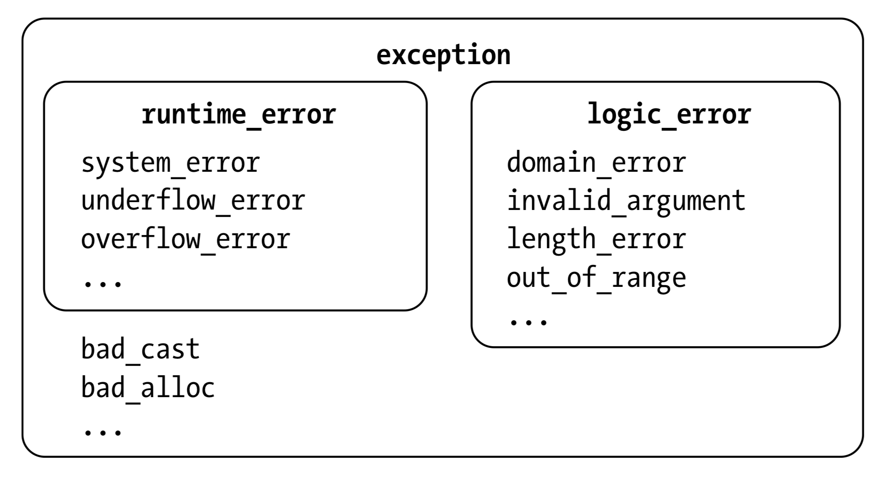
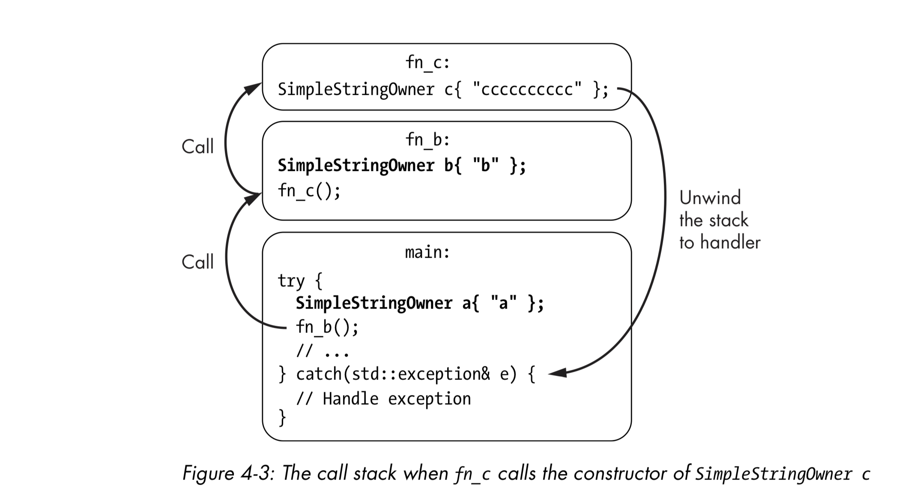
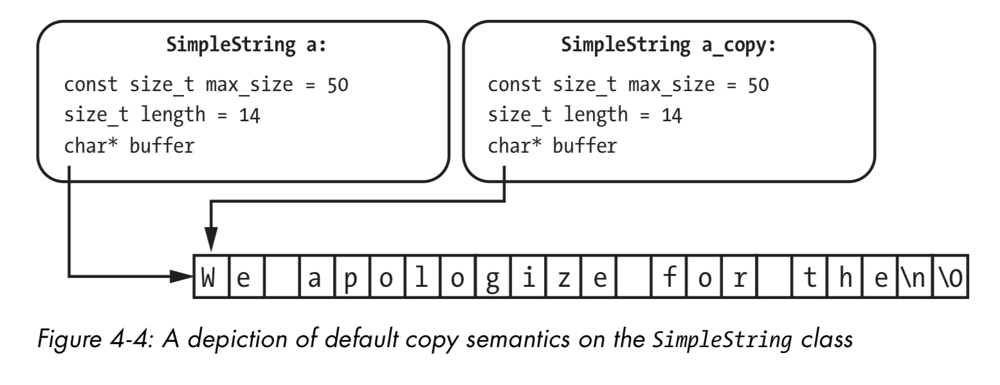
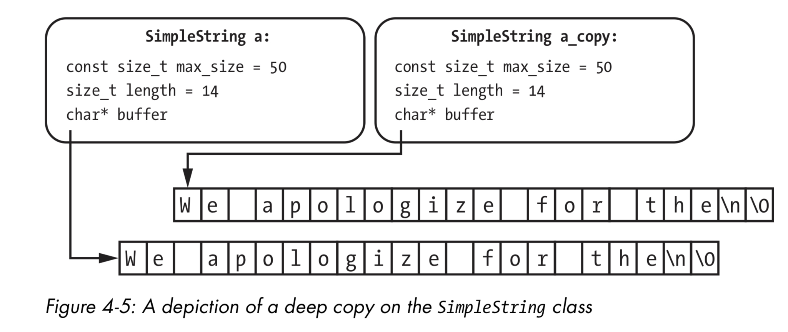
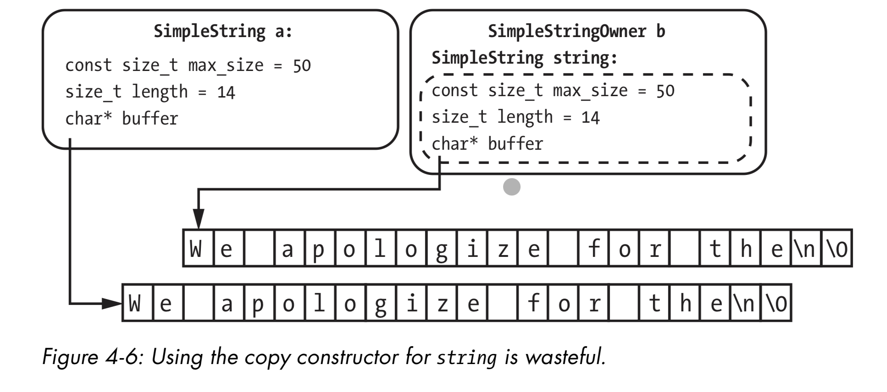
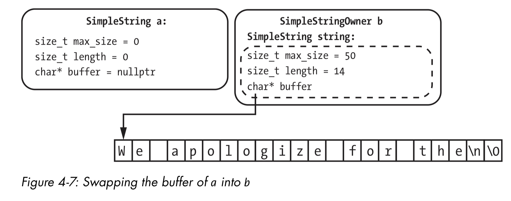

# Chapter 4 Notes: The Object Life Cycle

The object life cycle is a series of stages that a CPP object goes through during its lifetime. 

## Table of Contents

## An Objects Storage Duration

An *object* is really just a region of memory that holds a value and a type. When we declare a variable, we create an object (a variable is simply an object with a name).

**Allocation, Deallocation, and Lifetime**

Every object requires storage space in memory. We reserve storage through **allocation** and release it through **deallocation**. The objects **storage duration** is the time between allocation and deallocation. The objects **lifetime** begins once it is constructed, and ends just before the destructor is invoked. We can summarize the steps an object goes through as follows:

1. Objects storage begins, storage is allocated.
2. The objects constructor is called.
3. The objects life cycle begins.
4. We use the object in the program.
5. The objects life cycle ends. 
6. The objects destructor is called.
7. The objects storage durations ends, storage is deallocated.

Storage duration and lifetime are not the same thing. Storage is between allocation and deallocation, lifetime is between constrution and destruction.

**Memory Management**

Other programming languages use automatic memory managers or garbage collectors. At runtime, the program creates objects, and the garbage collector will monitor what objects are being used and what are not. It will deallocate the objects that are not being used from memory. This means that we do not have to worry about the memory management of our program, but there are some performance costs. 

C++ does not take this approach, it relies on us (the programmer) the manage the object life cycles.

**Automatic Storage Duration**

An *automatic object* is allocated at the beginning of an enclosed block of code and is deallocated at the end of that block. Automatic objects are said to have an automatic storage duration. Function parameters are automatic objects, even though they appear outside of a function body.

    void foo(int x) // x is an automatic object
    {
        int y; // y is an automatic object
    } // x and y are destroyed here

Both `x` and `y` are allocated each time that `foo` is called, just before `foo` ends, the variables are deallocated. 
Automatic variables are also known as *local variables*. This is because we cannot access them outside of the function they are located in. 

**Static Storage Duration**

A *static object* is declared using the `static` or `extern` keywords. We can declare static variables at the same level we declare functions (at a global scope). Static objects with global scope have *static storage duration*, that is allocated when the program starts and deallocated when it ends. 

    #include <iostream>

    static int nuclear_power = 200;

    void power_up_reactor(int nuclear_isotopes) {
        nuclear_power += nuclear_isotopes;
        const auto waste_heat = nuclear_power * 20;
        if (waste_heat > 5000) {
            std::cout << "Warning! Reactor overheating!\n";
        }
    }

    int main() {
        power_up_reactor(10);
        power_up_reactor(20);
        power_up_reactor(30);
    }

The static variable `nuclear_power` is declared with the `static` keyword and has global scope (it can be accessed anywhere in the program). Because nuclear_power is a static variable, its lifetime is the programs lifetime. This means we can alter it all the way up until the program ends. `waste_heat` is an *automatic variable* because it is declare inside of the function, meaning that its lifetime is only that function call lifetime. 

When we use the `static` keyword we specify an *internal linkage*, this mens that a variable is inaccessible to other translation units (these translation units are just source files with the included header files, step 1 of the compiler tool chain). If we want to make the variable accessible to other translation units *external linkage*, we use the `extern` keyword. 

    // file1.cpp
    static int x = 0; // internal linkage

    // file2.cpp
    extern int x; // external linkage

Basically if we use `extern` we can access the variable in other translation units, if we use `static` we cannot.

**Local Static Variables**

Local static variables are special kinds of static variables that have local scope, not global. Local static variables are declared *within* the functions scope just like automatic variables. Their lifetime is the same as automatic variables. 

    #include <iostream>

    void power_up_reactor(int nuclear_isotopes) {
        static int nuclear_power = 200;
        nuclear_power += nuclear_isotopes;
        const auto waste_heat = nuclear_power * 20;
        if (waste_heat > 5000) {
            std::cout << "Warning! Reactor overheating!\n";
        }
        std::cout << "Current power: " << nuclear_power << '\n';
    }

Unlike the code in `static_objects.cpp` we cannot refer to `nuclear_power` outside of the function. This is because it has local scope. This programming paradigm is known as *encapsulation*, where we bundle together data with a function that operates on the data. Note that each time the function is called, the `nuclear_power` variable is reset back to 200.

**Static Members**

Static members are members of a class that are not associated with a particular instance of a class (these are class variables in python). Normal class members have a lifetime that is the same as the object they are associated with. Static members have a lifetime that is the same as the program (they have static storage duration).

When we are declaring a static member, we must refer to them using the classes name then the scope resolution operator `::`, apart from a specific scenario, we need to init static members at a global scope (outside of the class). The special case is when we are using `integral types`, if so we can define within the class definitions, but they must also be `const`.

    class foo {
    public:
        static int x; // declaration
        static const int y = 10; // init (because it is const and integral type)
    };

    int foo::x = 0; // definition

    int main() {
        foo::x = 10;
        std::cout << foo::x << '\n';
    }
    
All instances of the class `foo` will share these static class members. If these members are altered, they are altered for all instances of the class.

    class NuclearReactor {
    public:

        static int reactor_power;

        static void power_up_reactor(int nuclear_isotopes) {
            reactor_power += nuclear_isotopes;
            const auto waste_heat = reactor_power * 20;
            if (waste_heat > 5000) {
                std::cout << "Warning, reactor overheating!" << std::endl;
            }
            std::cout << "Reactor power: " << reactor_power << std::endl;
        }
    };

    int NuclearReactor::reactor_power = 1000;

    int main(void) {
        NuclearReactor::power_up_reactor(10);
        NuclearReactor::power_up_reactor(20);
        NuclearReactor::power_up_reactor(30);
    }

The `NuclearReactor` class contains a static member and a static method. When we are writing the method, because `reactor_power` is part of the class, we can write our code as normal (we do not need to scope resolution operator `::` to access the static method). However, once we are out of the class, we need the scope resolution operator to set the value of the static member, and to call the static method. Also note that we are initing the value of `reactor_power` in the global scope, as we should with static members. 

**Thread Local Storage Duration**

A fundamental concept in concurrent programming is the *thread*. Each program has one or more threads that perform independent operations. The sequence of instructions that the thread is executing is called the *thread of execution*.

We must take extra precautions when using more than one thread of execution. Code that is safe for multiple threads to execute is called *thread safe code* Mutable global variables are a **main** source of issues when using multiple threads (it is quite easy to see why, if one thread changes the global value, but another thread is already working on that value, we can get some unexpected results). 

Sometimes we can avoid issues with mutable global variables by giving each thread a copy of the variable to work with. We do this by specifying that an object has a *thread storage duration* by adding the `thread_local` keyword to the `static` or `extern` keywords. 

Note: if we only use `thread_local` then `static` is assumed.

This code is **NOT** thread safe. 

    #include <iostream>

    void power_up_reactor(int nuclear_isotopes) {
        static int nuclear_power = 200;
        nuclear_power += nuclear_isotopes;
        const auto waste_heat = nuclear_power * 20;
        if (waste_heat > 5000) {
            std::cout << "Warning! Reactor overheating!\n";
        }
        std::cout << "Current power: " << nuclear_power << '\n';
    }

This code will be *thread safe*.

    #include <iostream>

    void power_up_reactor(int nuclear_isotopes) {
        static thread_local int nuclear_power = 200;

        ----- snip -----
    }

Now each thread being used would get its own copy of `nuclear_power` to work with. The modification made by one thread would not affect the others. We will discuss more about concurrent programming later.

## Dynamic Storage Duration

Objects that have dynamic storage duration are allocated and deallocated on request of the programmer. We have manual control over the dynamic objects lifetime. The way to allocate some space for an object is to use the `new` keyword, followed by the data type of the object. When we use `new` it will return a pointer to the object we are creating.  

    int* my_int_ptr = new int; // allocate space for an int, and return a pointer to it

Here we are declaring a pointer for an int, then we are initialzing it with the value that `new` returns to us. We can then use the pointer to access the object. 

    *my_int_ptr = 10; // set the value of the object to 10

We could also init the value when creating the object. 

    int* my_int_ptr = new int{10}; // init the value of the object to 10

We deallocate an object using the `delete keyword`, followed by the pointer to the object we want to deallocate. 

    delete my_int_ptr; // deallocate the object

Note that just because we have freed the memory, this does not mean that the value isnt still in that place in memory. There is a common bug called *use after free* where our program is still using memory that we have freed but still works because the values are what we are expecting. 

**Dynamic Arrays**

We can also create arrays with dynamic storage duration. We again use the `new` keyword.

    int* my_array_ptr = new int[10]; // allocate space for 10 ints

The number does not have to be constant, we can determine the size of the array at runtime. 

    int size = some other thing here...;
    int* my_array_ptr = new int[size]; // allocate space for size ints

To deallocate a dynamic array, we use the `delete` keyword just like before. 
    
    delete[] my_array_ptr; // deallocate the array, note we do NOT have to pass the length. 

**Memory Leaks**

When we use such a powerful tool, we have a lot of responsibility. With every dynamic object that we allocate, we MUST deallocate it with `delete`

**Tracing the Object Life Cycle**

Lets explore an program that allows us to trace the lifecycle of some objects (so we are looking at construction to destruction).

    #include <iostream>
    #include <string>

    class Tracer {
    private:
        const std::string name;

    public:
        // Constructor
        Tracer(std::string name) : name{ name } {
                std::cout << name << std::endl;
            }
        
        // Destructor
        ~Tracer() {
            std::cout << name << "Destroyed" << std::endl;
        }
    };

Here we create a Tracer class, the class has a private attribute and a constructor and destructor. Consider the following program, we should be able to tell when objects will be constructed and destructed. 

    static Tracer t1{ "Static variable" };
    thread_local Tracer t2{ "Thread-local variable" };

    int main(void) {
        std::cout << "A" << std::endl;
        Tracer t3{ "Automatic variable" };
        std::cout << "B" << std::endl; 
        Tracer* t4 = new Tracer{ "Dynamic variable" }; // Notice here that we do not "delete" our dynamic variable.
        std::cout << "C" << std::endl;
        }

    Output --------------------
    Static variable
    Thread-local variable
    A
    Automatic variable
    B
    Dynamic variable
    C
    Automatic variable Destroyed
    Thread-local variable Destroyed
    Static variable Destroyed

As expected, the static variable is constructed first, followed by the thread local variable (when we use thread_local, static is assumed unless stated otherwise). This is done before we even hit main, as static variables life cycle is when the program starts to when the program ends. We the enter main, print A. Then our automatic variable is constructed (this will be local to main). We then print B, then we dynamically create a new tracer object and it is constructed (notice that t4 is a pointer and not the object itself). We then print C and the program ends. As expected the order of destruction is Automatic (because it is local to main), then Thread and then Static (when the program officially ends). But notice that nothing happened for `t4`. This is because we did not deallocate our memory so the destructor is never called, this is a memory leak.

## Exceptions

Exceptions are types that communicate that there is an error happening in our code. When an error occurs, our programs *throws* and exception, after it is thrown, the exception is *in flight* and the program stops executing the code it was working on and starts to look for an *exception handler* that will manage the in-flight exception. We can also handle errors by returning an error code, we commonly the returning technique when an certain error is really common or it can be dealt with locally.

**Throwing an Exception**

We throw an exception using the `throw` keyword, which is followed by some throwable object, most objects are throwable in C++ but it is common to use one of the exception objects in the C++ standard lib, such as the `std::runtime_error` object. This is included inside of the `<stdexcept>` header. The `runtime_error` object accepts a null-terminated `char*` (a string) that describes the error that has occurred.

    throw std::runtime_error{ "Something went wrong" };

Here is a program with is in use:

    #include <iostream>
    #include <stdexcept>

    class Reject10 {
    public:
        void throw_an_exception(long x) {
            if (x == 10) {
                throw std::runtime_error("The number 10 has been entered, this is not allowed");
            }
            else {
                std::cout << "This number is okay" << std::endl;
            }
        }
    };

    int main(void) {
        Reject10 number_rejector;
        number_rejector.throw_an_exception(11);
        number_rejector.throw_an_exception(1524371236412);
        number_rejector.throw_an_exception(10);
        number_rejector.throw_an_exception(1);
    }

    Output --------------------
    This number is okay
    This number is okay
    libc++abi: terminating due to uncaught exception of type std::runtime_error: The number 10 has been entered, this is not allowed
    zsh: abort      ./throwing_exceptions

**Using try-catch Blocks**

We can use `try-catch` blocks to handle exceptions. We use the `try` keyword, followed by a block of code that we think could throw an error. We then use the `catch` keyword, followed by a block of code that will handle the error. 

    try {
        // code that could throw an error
    }
    catch (/* exception type */ e) {
        // code that handles the error
    }

    #include <iostream>
    #include <stdexcept>

    class Reject10 {
    public:
        void throw_an_exception(long x) {
            if (x == 10) {
                throw std::runtime_error("The number 10 has been entered, this is not allowed");
            }
            else {
                std::cout << "This number is okay" << std::endl;
            }
        }
    };

    int main(void) {
        Reject10 number_rejector;
        try {
        number_rejector.throw_an_exception(11);
        number_rejector.throw_an_exception(1524371236412);
        number_rejector.throw_an_exception(10);
        number_rejector.throw_an_exception(1);   
        }
        catch (const std::runtime_error error) {
            std::cout << "Exception caught with error message " << error.what() << std::endl;
        }

    }

    Output --------------------
    This number is okay
    This number is okay
    Exception caught with error message The number 10 has been entered, this is not allowed

We can arrange exceptions using inheritance, but for simple code it is best to just use the standard ones, why reinvent the wheel?

**Standard Exception Classes**

The standard lib provides us with several *standard exception classes* inside of the `stdexcept` header. These classes should be our first point of call when dealing with exceptions. `std::exception` is the superclass for all exceptions but we can arrange the subclasses into 3 categories: Logic errors, runtime errors, language support errors. 

**Logic Errors**

Logic errors are derived from the `logic_error` class. These are errors that the complier does not pick up as the syntax is correct, but the program does not behave as expected. For example if a programmer passes the wrong parameter to a constructor, we can throw a logical error.

There are several kinds of subclasses of `logic_error`:

- `domain_error` ----> Thrown when a error occurs related to a valid input range, for example a square root function will only take positive numbers. If it is given a negative then we can throw a domain error.
- `invalid_argument` ----> Thrown when an argument is invalid, for example if we pass a null pointer to a function that does not accept null pointers.
- `length_error` ----> Thrown when a length is invalid (it violates a length constraint), for example if we try to create a string that is too long.
- `out_of_range` ----> Thrown when a value is out of range, for example if we try to access an element in a vector that is out of range.

**Runtime Errors**

Runtime errors are derived from the `runtime_error` class. These are errors that occur outside of the programs scope (so after compilation). An example of this would be zero division, where the code is correct, but at runtime the function is being passed a zero to divide by.

There are several kinds of subclasses of `runtime_error`:

- `system_error` ----> This occurs when the operating system encounters some error. This is an important one. Inside of the `<system_error>` header there are a large number of error codes and error conditions that we can use. When a system error is constructed, there is lots of info packed in.
- `overflow_error` and `underflow_error` ----> These are thrown when a value is too large or too small to be represented by the data type.

Other errors such as `bad_alloc` directly inherit from `exception`, this is thrown when `new` fails to allocate required dynamic memory.

**Language Support Errors**

We will not be using language support errors directly. They exist to indicate that some core language feature has failed at runtime.

**Handling Exceptions**

A `catch` block is executed when the error that is thrown matches the handle for the catch block, OR the error that is thrown inherits from the catch handlers exception type (so if we throw a logic_error and the catch handlers exception type is `std::exception` then our error will be handled by the code in that block).

    try {
        throw std::logic_error{ "Something went wrong" };
    }
    catch (std::exception e) {
        std::cout << "Exception caught" << std::endl;

    }

We can also have catch blocks that will accept *all* errors that are thrown in the try block. 

    try {
        //some code here
    }
    catch (...) {
        //handle any error.
    }

The catch all handler is usually used as a last resort (when non of the other handlers match the error that is being thrown). We can chain multiple catch statements together to handle different errors. 

    try {
        //some code here
    }
    catch (std::logic_error e) {
        //handle logic error
    }
    catch (std::runtime_error e) {
        //handle runtime error
    }
    catch (std::exception e) {
        //handle any other error
    }
    catch (...) {
        //panic. Unforeseen exception was thrown. 
    }

**Rethrowing Exceptions**

In a catch block, we can throw another error, this is called *rethrowing* an exception. 

    try {
        // Some code that will throw a system error.
    }
    catch (std::system_error e) {
        std::cout << "System error caught" << std::endl;
        if (e.code() != std::errc::permission_denied) {
            // The error is not permission denied
            throw; // Rethrow the error
        }
        else {
            //recover from a permission denied error. 
        }
    }

In this code, we catch all system errors, but unless the error is a permission_denied error, we rethrow the exception. There are penalties in performance when doing this, and the resulting code is often convoluted. Rather then rethrowing an exception we can we can define a separate `catch` handler for the EACCESS error (permission denied error).

    try {
        // throw a PermissionDenied
    }
    catch (PermissionDenied error) {
        // handle the error
    }
    catch (std::system_error error) {
        // handle all other system errors
    }

**User Defined Exceptions**

We can also define our own exceptions, these will usually inherit from `std::exception`. 

**The noexcept Keyword**

The `noexcept` keyword is used to indicate that a function will not throw an exception under any circumstance.

    bool is_odd(int x) noexcept {
        return (x % 2) == 1; // will return true or false, cannot error. 
    }

using `noexcept` we enter a contract that using a function marked as such will not throw an error. In exchange, we must be careful when marking functions with `noexcept` since the complier will not check it for us. If we mark a function as `noexcept` but it does throw an error, the program will terminate. There is no way to recover from it.

    void throw_an_error() noexcept {
        throw std::runtime_error{ "This function will throw an error" };
    }

    int main(void) {
        try {
            throw_an_error();
        }
        catch (std::exception e) {
            std::cout << "Exception caught" << std::endl;
        }
    }

    Output --------------------
    libc++abi: terminating with uncaught exception of type std::runtime_error: This function will throw an error
    zsh: abort      ./noexcept

**Call Stacks and Exceptions**

The call stack is where we keep all of the information about active functions such as the caller the callee. When we call a new function, this sort of info is collected into a *stack frame* which is the pushed onto the top of the stack. When the function returns, that stack frame is popped off the top of the stack, and the previous stack frame resumes running. 

This process is essential when handling errors. The runtime will always look to find the closest handler to a throw expression. It will first search the current stack frame, if a correct handler is there, it will use that, else it goes to the next stack frame. Any objects whos lifetime ends are destroyed on the way as the call stack unwinds.

**Throwing in Destructors**

Throwing in destructors is complex. 

If an exception is thrown and while the runtime is unwinding the call stack and destroying objects on the way, what happens if one of the object destructors throws an exception during that normal clean up? We now have 2 exceptions in flight. C++ will handle this by calling `terminate`.

    #include <iostream>
    #include <stdexcept>

    class CyberdyneSerries800 {
    public:
        CyberdyneSerries800() {
            std::cout << "CyberdyneSerries800 constructed" << std::endl;
        }

        ~CyberdyneSerries800() {
            std::cout << "CyberdyneSerries800 destroyed" << std::endl;
            throw std::runtime_error{ "CyberdyneSerries800 destructor threw an error" };
        }
    };
    
    int main(void) {

        try {
            CyberdyneSerries800 terminator;
            throw std::runtime_error{ "Main threw an error" };
        }
        catch (std::exception e) {
            std::cout << "Exception caught: " << e.what() << std::endl;
        }

    }

Because terminator is a local variable to the try block, its destructor gets called when we throw the runtime error, this invokes the error that is inside of the destructor. So our program terminates. 

As a general rule of thumb, we should treat destructors as if they we `noexcept`.

## A SimpleString Class

Lets now explore how constructors, destructors, members and exceptions all gel together with a larger example. We will create a class that allows us to add C-style strings together and print the result.

    #include <stdexcept>

    class SimpleString {
    private:
        size_t max_size;
        size_t length;
        char* buffer;

    public:
        // Constructor
        SimpleString(size_t max_size) :
            max_size{ max_size }, length{} {
                if (max_size == 0) {
                    throw std::runtime_error{ "The max size must be at least 1. "};
                }
                buffer = new char[max_size]; // Allocating new memory from the heap of max_size. Because we are allocating we must delete.
                buffer[0] = 0;
            }

        // Destructor
        ~SimpleString() {
            delete[] buffer;
        }
    };

The constructor takes a single parameter `max_size` this is the maximum length of our string, including the null terminator (we use `size_t` as the dtype to avoid negative numbers, saving us having to check). The member initializer list then assigns the max size to our class member variable and we assign length to 0 (implicitly with {}) this gives us space to at least contain the null-terminator. This value is also used to allocate memory when creating our buffer. Because the current string is initially empty, we set the first element of the buffer to 0.

Because we are allocating memory in the constructor, the SimpleString owns resources. We already know that when we allocate memory we must free it. In the destructor, we free the memory back to the computer. If we allocate in the constructor and deallocate in the destructor, we will never leak memory. This design pattern is called *resource acquisition is initialization* (RAII) or constructor acquires, destructor releases (CADRe).

**Appending and Printing**

We now are going to add a print and add functionality, this will allow the user to add a string to the buffer and then print them out.

    #include <iostream>
    #include <stdexcept>
    #include <cstring>

    class SimpleString {
    private:
        size_t max_size;
        size_t length;
        char* buffer;

    public:
        // Constructor
        SimpleString(size_t max_size) :
            max_size{ max_size }, length{} {
                if (max_size == 0) {
                    throw std::runtime_error{ "The max size must be at least 1. "};
                }
                buffer = new char[max_size]; // Allocating new memory from the heap of max_size. Because we are allocating we must delete.
                buffer[0] = 0;
            }

        // Destructor
        ~SimpleString() {
            delete[] buffer;
        }

        // Prints out a string and its tag.
        void print_string(const char* tag) const {
            std::cout << tag << buffer; 
        }

        // Adds a string and appends a newline and a null byte to the end of the string.
        bool append_line(char* string_to_add) {
            const auto len_of_str = strlen(string_to_add);
            // Check that the max size is at least 1.
            if (len_of_str + length + 2 > max_size) {
                return false;
            }
            std::strncpy(buffer + length, string_to_add, max_size - length);
            length += len_of_str;
            buffer[length++] = '\n';
            buffer[length] = 0;
            return true;
        }
    };

`print_string` prints the string to the console, we can alos provide a tag so we can match an invocation of print with a result.

The `append_line` method is a bit more complex, it takes a null-terminated string as an argument. It will then compute the length of the string being added to the buffer. Once we have that, we check that we have enough room for the string, a newline and a null byte in the buffer. After that we use the `strncpy` method from the `<cstring>` library and pass in the destination, the source and how many bytes we need to copy from source to destination. After we have done that, we add the newline char and then null byte

I have changed some of the code and it now looks like:

    #include <iostream>
    #include <stdexcept>
    #include <cstring>

    class SimpleString {
    private:
        size_t max_size;
        size_t length;
        char* buffer;

    public:
        // Constructor
        SimpleString(size_t max_size) :
            max_size{ max_size }, length{} {
                if (max_size == 0) {
                    throw std::runtime_error{ "The max size must be at least 1. "};
                }
                buffer = new char[max_size]; // Allocating new memory from the heap of max_size. Because we are allocating we must delete.
                buffer[0] = 0;
            }

        // Destructor
        ~SimpleString() {
            delete[] buffer;
        }

        // Prints out a string and its tag.
        void print_string() const {
            std::cout << buffer; 
        }

        // Adds a string and appends a newline and a null byte to the end of the string.
        bool append_line(char* string_to_add) {
            const auto len_of_str = strlen(string_to_add);
            // Check that the max size is at least 1.
            if (len_of_str + length + 2 > max_size) {
                return false;
            }
            std::strncpy(buffer + length, string_to_add, max_size - length);
            length += len_of_str;
            buffer[length++] = '\n';
            buffer[length] = 0;
            return true;
        }
    };

    int main(void) {
        SimpleString my_sentence{30};
        my_sentence.append_line("Hello");

        if (!my_sentence.append_line("My name is")) {
            std::cout << "The sentence is too long to fit into the buffer you have created, add more buffer.\n";
            return 1;
        }

        if (!my_sentence.append_line("Cameron Wheeler")) {
            std::cout << "The sentence is too long to fit into the buffer you have created, add more buffer.\n";
            return 1;
        }

        my_sentence.print_string();
    }

**Composing a SimpleString**

Lets consider what happens when we are defining a class that contains SimpleString member:

    #include <stdexcept>

    class SimplerStringOwner {

    private:
        SimpleString string;

    public:
        // Constructor
        SimpleStringOwner(const char* x)
            : string{ 10 } {
                if (!string.append_line(x)) {
                    throw std::runtime_error{ "Not enough space to add string" };
                }
                string.print_message("Constructed");
            }
         
        // Destructor 
        ~SimpleStringOwner() {
            string.print_message("Destroyed");
        }   
    };

Here we are using a member init list to construct a string with a buffer of 10. We then append the string that is passed to the constructor to add it to the buffer. We then print a message to say that hte string class has been constructed. 

This illustrates the order of construction, an objects members must be constructed before the encapsulating object. This is intuitive, how can we construct an object without constructing its members?

Destruction is the opposite, we destruct the encapsulating object before destructing its members. 

Basically and objects member constructors are called before the encapsulating object constructor. 

**Call Stack Unwinding**

    ----- snip -----
    void function_c() {
        SimpleStringOwner c{ "ccccccccccccccc" };
    }

    void function_b() {
        SimpleStringOwner b{ "b" };
        function_c();
    }

    int main(void) {
        try {
            SimpleStringOwner a{ "a" };
            function_b();
            SimpleStringOwner d{ "d" };
        }
        catch (const std::exception error) {
            std::cout << "Exception caught: " << error.what() << std::endl;
        }
    }

    Output --------------------
    Constructed: a
    Constructed: b
    About to destroy: b
    About to destroy: a
    Exception caught: Not enough space to add string

The call stack before reaching the error, which is when function_c is called looks like `main --> function_b --> function_c`. The current objects that are active are `a` and `b`. When we reach the runtime error (we are trying to append to many c's to the string) we now have an exception in flight. The runtime will now start to unwind the call stack until we find a handler for the exception. function_c doesnt have one, so we unwind to b, function b doesnt either so we unwind to main. This means that the destructor for b is called. Then we hit main, where there is a handler. BUT the SimpleStringOwner a is a local variable to the try block. So that must be destroyed before we leave to the catch block. So the destructor for a is called. We then see the error message printed to the terminal.

**Exceptions and Performance** 

If we use exceptions our programs will face NO overhead if there are no errors. We only get a performance hit when an error is thrown. However, the book argues that we should still use them, and I agree. If our program goes wrong, we want to it to be handled correctly (there is a slight problem with this in embedded systems that require real time actions, but we will get to that later). 

It is also worth considering the code patterns that we use, when using the RAII/CADRe pattern, we can use exceptions and when the call stack unwinds, we can be certain we do not leak any memory. When it is done differently we might introduce memory leaks into our program when the call stack starts to unwind.

**Alternatives to Exceptions**

When we cannot use exceptions, we must handle the errors on our own. But there are ways that we can do this to make our lives easier. 

1. We can make functions that check that all the class invariants are met. 

Note: Refresher on class invariants - A class invariant is a condition that must be true for all objects of a class. It is a logical condition to ensure the correct working of a class. Class invariants must hold at the end of every public operation. In other words, a class invariant is a property of a class that is always true, regardless of the state of the object. This might be if we have a Rectangle class, the height and width must be positive, they cannot be negative. This is a class invariance. Another would be that their area is computed by width * height, we must enforce that this is true and update the area anytime a change in height or width happens.

class Class1 {
public:
    Class1();
    invariants_hold_true();
    ---- snip ----
};

Instead of putting an exception in the constructor, we now must check for errors in our calling code.

bool foo() {
    Class1 my_class{};
    if (!my_class.invariants_hold_true()) {
        return false;
    }
    // Class invariants are now guaranteed to be true.
    ---- snip ----
    return true;
}

2. Structured binding declaration. This is a feature of C++ that allow sus to return multiple values from a function call. We can use this feature to return a success flag alongside a value that we actually want to return. 

    class ConstructorResult {
    public:
        Class1 my_class;
        bool success;
    }

    ConstructorResult make_a_class1_instance() {
        Class1 my_class{};
        bool is_valid = my_class.invariants_hold_true();
        return { my_class, is_valid };
    }

    bool foo() {
        auto [my_class, success] = make_a_class1_instance();
        if (!success) {
            return false;
        }
        // Class invariants are now guaranteed to be true.
        ---- snip ----
        return true;
    }

First we declare a Plain Old Dataclass that contains a class1 object and a success flag. We then create a function that constructs and validates a class1 object (note that this function returns the POD that we have created just before). This pattern is called a *factory* pattern, in turn the methods are called *factory methods* its their job to build a verify objects. We then pack the results and return them. The syntax at the call site, shows us that we can unpack the result using `auto` deduced variables.

This looks like a similar way to how python works, when we return multiple values, it is just a bit more verbose (as is most C++) and the syntax is different, we must ensure that we use the [] and {} in the appropriate places.

## Copy Semantics

When programmers use the term copy semantics, we mean the rules that govern how we copy objects. After `x` is copied to `y` with `x = y` such that `x == y` is true, they are said to be equivalent and independent. That is they are both the same value, but if I change one, the other doesn't change. 

Making copies is extremely common, especially when we are passing objects to functions by *value* (we just pass the function the object, no reference or pointer).

    #include <iostream>

    int add_one(int x) {
        x++;
        return x;
    }

    int main(void) {
        int original = 10;
        int copy = add_one(original);
        std::cout << "Original: " << original << std::endl;
        std::cout << "Copy: " << copy << std::endl;
    }

    Output --------------------
    Original: 10
    Copy: 11

Our function takes a copy of original, not the actual value in the original memory location, increments it by 1 and then returns the copy. We assign this copy to to the variable `copy`. We can see that the original value is unchanged.

This is the same for user defined POD types. Passing a POD into a function will cause all of the members to be copied. 

    #include <iostream>

    class Point {
    public:
        int x;
        int y;
    };

    Point make_transpose(Point p) {
        tmp = p.x;
        p.x = p.y;
        p.y = tmp;
        return p;
    }

When we call the make transpose function and pass in the POD point by value, it receives a copy of the POD and the original is unchanged. This is rather straightforward for PODs and fundamental types, each member is just copied from memory location to another.

This process that we have seen is called *member wise copy*. Its rather straightforward, when we copy types member wise, each member is copied into its corresponding destination. 

Fully featured classes require some more thought however, the *default* copy semantics is member wise copy, but this can cause some problems when working with the most simplest of classes like our simple string class. 

If we consider the simple string class that we have and look at the code, the fact that we are pointer as a member invites diaster, as the pointer for both the copies of the class will be pointing at the same location in memory. 

It gets even worse when the simple string classes start to destruct, they will free the same buffer. If the copy tries to write to that memory, we can get undefined behavior. Finally when the copy destructs, it will free memory that has already been freed. This is called a *double free*. 

Double frees occur when we try to deallocate memory twice, they are VERY hard to debug and can cause serious security vulnerabilities.

We can avoid these problems by taking control of our copy semantics.

**Copy Constructors**

*Copy construction* creates a copy and assigns it to a brand-new object. The copy constructor looks just like a normal constructor. 

    class Class1 {
    public:
        Class1(const Class1& other) {
            // Copy the other object into this object.
        }
    };

Other is a const, this is because we are copying from the original object, not changing anything. We can use the copy constructor like any other constructor.

    Class1 a{};
    Class1 a_copy{ a }; // Copy constructor is called here.

We can implement copy constructors for classes like `SimpleString`, what we want is a *deep copy* this is an exact copy of the original object, but into new memory, we want to copy the buffer from the original into a new block. 

Rather tha copying a pointer to buffer, we need to allocate new memory from the heap and copy all of the data pointed to by the original buffer across. 

    SimpleString(const SimpleString& other) {
        : max_size{ other.max_size }, buffer{ new char[other.max_size] }, length{ other.length } {
            std::strncpy(buffer, other.buffer, max_size);
        }
    }

Here we are creating a deep copy where in the member initializer list we are allocating new memory (the whole buffer) and then we just copy all of the buffer from the original to the copy using `strncpy`.

A copy constructor is invoked when we pass a object by value, so if we pass SimpleString to a function, it will use the copy constructor to create the copy for that function to use.

**Copy Assignment**

The other way to create a copy in C++ is with a *copy assignment operator*. We can take this literally as just the = sign, with simple types this works, `int a = 10; int b; b = a;` will work fine, but we get the same problem occurring with classes such as simple string, we will get two classes that point to the same buffer, which can result in double frees and dangling pointers. We can define the behaviour of the class when we use the copy assignment operator in C++, much like we can with `dunder methods __x__` in python. 

    class SimpleString {
        -- snip --
        SimpleString& operator=(const SimpleString& other) {
            if (this == &other) {
                return *this;
            }
            -- snip --
            return *this;
        }
    }

The copy assignment operator is returning the reference to the object (think of this as the object itself) with `*this`. Note that we are also checking that the address of the object is not the same as the address of the other object. This is because if we are assigning an object to itself, we do not want to do anything.

We can implement the copy assignment operator on our simple string easily. We just need to free the current buffer of `this` and the copy across from other.

    SimpleString& operator=(const SimpleString& other) {
        if (this == &other) {
            return *this;
        }
        const auto new_buffer = new char[other.max_size]; // Make a totally new buffer in memory
        delete[] buffer; // Delete the "copy" that was made when the object was constructed.
        buffer = new_buffer;
        max_size = other.max_size;
        length = other.length;
        std::strncpy(buffer, other.buffer, max_size);
        return *this;
    }

The copy assignment operator starts by allocating a new buffer, it then deletes the buffer that was already in the object before assigning the new buffer to the buffer of the object. We then cop the max_size, the length before using the `strncpy` method to copy the buffer from the other object to the current object.

1. A copy constructor is used to initialize a previously uninitialized object from some other object's data.
2. An assignment operator is used to replace the data of a previously initialized object with some other object's data.

**Default Copy**

The compiler will generate default implementations for copy construction and assignment. If at any point our class manages a resource, it is likely that the default implementation is WRONG (much like it was with SimpleString). Best practice dictates that we should explicitly decare that default copy construction and copy assignment are acceptable for a class using the `default` keyword. 

    class Class1 {
    public:
        Class1(const Class1&) = default; // Copy construction.
        Class1& operator=(const Class1&) = default; // Copy assignment.
    };

Some classes must not be copied at all, for example f our class manages a file. We can suppress the compiler from generating a copy constructor and a copy assignment operator using the `delete` keyword (this is the opposite of the `default` keyword).

    class Class1 {
    public:
        Class1(const Class1&) = delete; // Copy construction.
        Class1& operator=(const Class1&) = delete; // Copy assignment.
    };

Any attempt to copy class one will throw an error.

Whenever a class owns a resource, we should always consider how/if we want it to be copied, and we need to define how this is done explicitly, even if we are just using the default or delete keywords. This will save us a lot of headaches later. 

**Copy Guidelines**

1. Correctness - We must ensure that the class invariants are maintained. Our SimpleString class showed that the copy semantics were violating this guideline. 

2. Independence - After copy assignment or construction, the original and the copy should NOT change each-others states. Another way SimpleString violated the guideline. 

3. Equivalence - The original and the copy should be the same. The semantics depends on the context, but generally an operation applied on one, should yield the same result when applied on the copy. 

## Move Semantics

Copying can be quite time and resource consuming. Often we just want to transfer the *ownership* of resources from one object to another. If we want to do this, we can *move*. Move semantics requires that after an object is *moved into* another object, then they are both the equivalent. Once that is complete then the original object is in a *moved-from state* where there are only 2 things we can do, reassign or deconstruct. 

Similar to how we define copy constructor and assignment behavior we specify how a move behaves with the *move constructors* and *move assignment operators*

**Copying Can Be Wasteful**

Suppose that we want to move a SimpleString into a SimpleStringOwner class. 

    -- snip --
    void own_a_simple_string() {

        SimpleString my_string{ 50 };
        my_string.append_line("Hello");
        my_string.append_line("World");

        SimpleStringOwner my_string_owner{ my_string };
    }

We could create a SimpleStringOwner constructor and then copy-construct the SimpleString member across just like so:

    class SimpleStringOwner {
    public: 
        SimpleStringOwner(const SimpleString& x) : string{ x } {}
    private:
        SimpleString string;
    };

There is some wasted compute in this, we have a copy-construction that copys x but then we never use the pointed to object again once we have constructed the string. We are basically using more memory to make a copy, when we don't really need to, we just want to transfer ownership.

What we want to do is move the guts from SimpleString into the `string` field of SimpleStringOwner. This will allow us to destruct SimpleString safely without loss of information.

Once we have moved my_string into my_string_owner, we place my_string into a *moved-from state* where it is safe to destruct. Moving can be dangerous however, if we use a *moved-from* object, we are going to get undefined behavior. For example if we try and use the string after we have moved it from SimpleString to SimpleStringOwner, we will get disaster. The compiler has some guards to stop us from doing this ----> lvalues and rvalues.

**Value Categories** 

Every expression has 2 important characteristics 1. its *type* 2. its *value*.

The value category describes what operations can be applied to it. There are certain types of values in C++, a 'generalized value' (glvalue), a 'pure rvalue' (prvalue), an 'expiring value', an 'lvalue' (a gvalue that is not an xvalue) or an 'rvalue' (a prvalue or a xvalue). 

We do not really care much about these as C++ newcomers, we just need to understand lvalues and rvalues. An lvalue is anything that has a name, an rvalue is everything else. 

    SimpleString my_string{ 50 };
    SimpleStringOwner{ my_string }; // my_string is an lvalue.
    SimpleStringOwner{ SimpleString{ 50 } }; // SimpleString{ 50 } is an rvalue.

We can think of this much more simply, the left values (lvalues) are on the left hand side of the assignment operator, the right values (rvalues) are on the right hand side of the assignment operator. int x = 10 --> x is an lvalue, 10 is an rvalue. This doesn't hold up to much scrutiny as we can have lvalues on the right (for example during a copy assignment, this is demonstrated above).

An lvalue is a value that has a place in memory, an rvalue does not. This can easily be spotted in programs. But there are some weird ones. Make sure that we are reading the error message that the compiler gives us and we will be able to spot them.

**lvalue and rvalue references**

We can communicate with the compiler that a function takes lvalues or rvalues using lvalue and rvalue references. So far we have only been using lvalue references (using &), but we can take our parameter by rvalue using &&. This is really handy in move semantics (what we are currently exploring).

    void print_int(int& x) {
        std::cout << "lvalue reference: " << x << std::endl;
    }

    void print_int(int&& x) {
        std::cout << "rvalue reference: " << x << std::endl;
    }

    int main(void) {
        int x = 10;
        print_int(x); // lvalue reference
        print_int(10); // rvalue reference
        print_int(x + 4) // rvalue reference, we create the x+4 pass it to the function then get rid.
    }

We can use function overloading to create multiple functions with the same name, the compiler will work out what to call for us, we know this is called function overloading already.

**std::move Function** 

We can cast an lvalue reference to an rvalue reference using the std::move function from the `<utility>` header. This is a cast, it does not move anything, it just tells the compiler that we want to treat the lvalue as an rvalue. 

    void print_int(int& x) {
        std::cout << "lvalue reference: " << x << std::endl;
    }

    void print_int(int&& x) {
        std::cout << "rvalue reference: " << x << std::endl;
    }

    int main(void) {
        int x = 10;
        print_int(x); // lvalue reference
        print_int(std::move(x)); // rvalue reference
    }

Just note that this function doesn't actually move anything, it just casts the lvalue into an rvalue. 

**Move Constructors**

Move constructors look like copy constructors, except they take rvalue references instead of lvalue references. Consider the example for a SimpleString move constructor. 

    SimpleString(SimpleString&& other) noexcept
        : max_size{ other.max_size }, buffer{ other.buffer }, length{ other.length } {
            other.length = 0;
            other.buffer = nullptr;
            other.max_size = 0;
        }

Becuase `other` is an rvalue reference, we are allowed to cannibalize it. We just copy all of the feilds from other into this and then put `other` into a moved from state (where we set it to 0 and null). We can also mark the move constructor as `noexcept` this is because our move constructor will never throw an error. Compilers prefer slow correct code instead of fast incorrect code. If we mark our move constructor as `noexcept` the compiler will accept our move constructor over the copy constructor (note that the compiler cannot use a error throwing move constructor). 

**Move Assignment**

We can also do the same for the assignment operator, we can use a rvalue reference instead of an lvalue reference. 

    SimpleString& operator=(SimpleString&& other) noexcept {
        if (this == &other) {
            return *this;
        }
        delete[] buffer;
        buffer = other.buffer;
        length = other.length;
        max_size = other.max_size;
        other.buffer = nullptr;
        other.length = 0;
        other.max_size = 0;
        return *this;
    }

We declare the move assignment operator using rvalue references and the `noexcept` keyword. We check that we have not referenced ourself before performing out moves. First we delete the current buffer that is in the object we are moving too, we then move all of the info from `other` (the object whos guts we are moving) into the current object. We then put `other` into a moved from state. Finally we return the refernce (return the object) back to the callee. 

Now that SimpleString is *movable* we can we can alter how we define the SimpleStringOwner constructor

    SimpleStringOwner(SimpleString&& x) : string{ std::move(x) } {}

The x is considered an lvalue inside of the constructor body (even though we passed it by rvalue reference) so we need to use std::move to cast it to an rvalue. If that is not there, then C++ will still continue to use the copy constructor. ---> https://www.youtube.com/watch?v=ehMg6zvXuMY&list=PLlrATfBNZ98dudnM48yfGUldqGD0S4FFb&index=89

    -- snip -- 
    int main(void) {
        SimpleString my_string_1{ 10 };
        my_string_1.append_line("Hello");
        SimpleString my_string_2{ 10 };
        my_string_2.append_line("World");
        my_string_1.print();
        my_string_2.print();
        my_string_2 = std::move(my_string_1);
        my_string_2.print();
    }

    Output --------------------
    Hello
    World
    Hello

First we decalred two classes and then printed out their messages. When the moved string 1 into string 2. We have to cast string 1 using std::move. We can see that the message from string 1 is now in string 2.

## 5 Methods That Govern Move and Copy Behaviour

1. Destructor
2. Copy constructor
3. Move constructor
4. Copy assignment operator
5. Move assignment operator

The compiler will generate default rules if we state nothing. But these defaults change betwee compilers, it is best to set the methods as default or delete ourselves if we to standardise everything. 